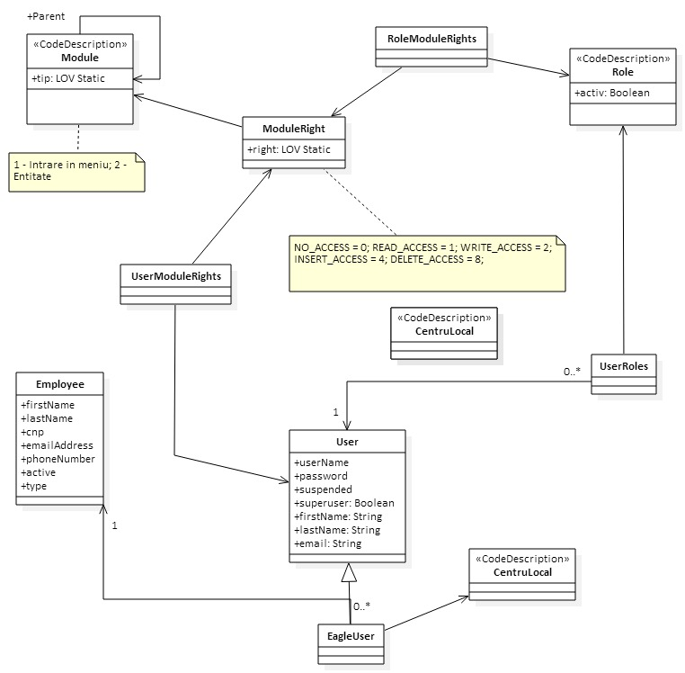

#Spring security data model and method annotation configuration module

## Preface

### Introduction

This is a separate module that implements a security data model and configures a custom MethodSecurityExpressionHandler

### Context

#### Model

A graphic data model for the security user and authorities is the following:



#### Method Annotation

The CustomGlobalSecurityConfiguration bean from the AdditionalSpringSecurityConfiguration class, annotated with
@EnableGlobalMethodSecurity(prePostEnabled = true, jsr250Enabled = true) lets us annotate custom method in the following way:

``` java

    @PreAuthorize("hasRole('ROLE_ADMIN')")
    public AppPage<Module> findAll(AppPageable appPageable) {
        return moduleRepository.findAll(appPageable);
    }

```

#### Security Filter

The SecurityAccessFilter class is used to intercept all request mapped like /rest/entityName or /rest/menuName and verifies
if the current user has access to the accessed menu or entity.

### Usage

There are four main tables : T_ACCOUNT, T_ROLE, T_MODULE_RIGHT and T_MODULE.

* T_ACCOUNT is the table that contains the application users. It has a relationship of many-to-many with T_ROLE and T_MODULE_RIGHT
* T_ROLE is the table that contains the first layer of the security model, containing values that specify the tipe of account;
The CODE column contains values like ROLE_USER, ROLE_ADMIN. This entity has a relationship of many-to-many with T_MODULE_RIGHT
* T_MODULE_RIGHT is the second layer or security and it simulates permissions per role. The permission values are contained in the
  ModuleRightTypeEnum enum. To be able to map these permissions to actual entities, menu etc, there is a many-to-one relationship
with the T_MODULE table
* T_MODULE is the table that contains the actual element on whitch one user has permissions. For each element type there should be
a row in the database table.
